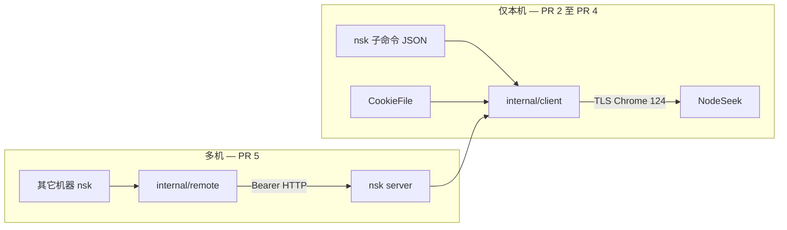
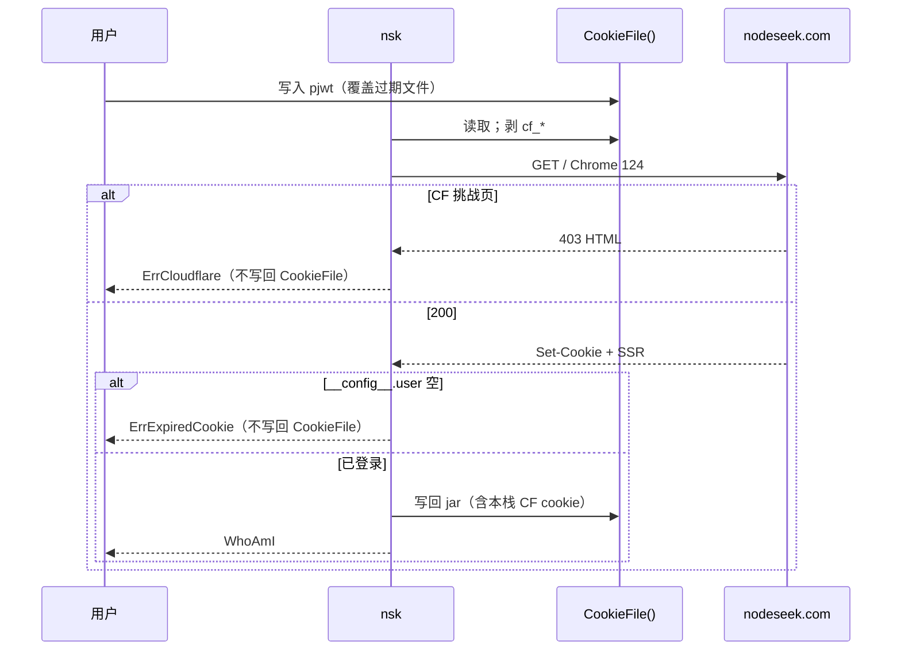

# nsk：NodeSeek 论坛终端客户端

| 字段     | 值                                                                          |
| -------- | --------------------------------------------------------------------------- |
| 状态     | Draft（修订 4：技术栈钉死，工程基线继承 modern-go-template）                |
| 日期     | 2026-09-15                                                                  |
| 作者     | Grok (design loop)                                                          |
| 实现仓库 | `/home/ubuntu/dev/nsk`                                                      |
| 对标     | `/home/ubuntu/dev/ldo`（linux.do / Discourse 终端客户端）                   |
| 技术栈   | [decisions/0001-technology-stack.md](../decisions/0001-technology-stack.md) |
| 站点     | `https://www.nodeseek.com`                                                  |

---

## Overview

`nsk` 是给 **AI / Agent** 用的 NodeSeek 论坛 CLI：一次性子命令，stdout 默认瘦
JSON，把论坛结构（板块、列表、帖、楼层、用户、通知）摊开给模型看。对标 `ldo` 的 Account / Server / Client / 一次性
JSON，**不做 TUI，不做摸鱼 REPL**。无参数时打印 `SiteStructure` JSON（板块表 + 分页常量 + 命令树），让 Agent
第一眼知道怎么走。

NodeSeek **不是** Discourse / Flarum / NodeBB / Discuz 等开源论坛产品。站点 HTML 是自研 Vue
SSR（`html data-server-rendered="true"`、自有 `nsk-*` DOM、`/post-{id}-{page}` URL）。登录态是 cookie `pjwt`，身份在
`window.__config__.user`。v1 用与 `ldo` 同类的 Chrome TLS 指纹 HTTP 客户端：`goquery` 解析 HTML + 少量 JSON
API。不引入浏览器，不引入 MCP，不引入 Bubble Tea。

站点 URL、每页条数、通知窗口等下列为 **假设（hypothesis）**，来源是未合并的 OpenCLI PR 1995 与
`chillpoints/nodeseek-mcp`。实现时以 PR-2 保存的全页 HTML/JSON 夹具为准，夹具与本文冲突时改代码常量，不改架构。

---

## Background & Motivation

`ldo`（`github.com/lhpqaq/ldo`）已经证明同一套形状能用：

- `internal/client.Forum` 是唯一论坛操作面；本机 `*Client` 与 `internal/remote.Client` 两个实现。
- XDG 配置 + **单一** `CookieFile()`（`[account].cookie` 相对 state 目录，默认 `cookie.json`）。
- `ldo server` 把 cookie 留在一台机器上，其它机器只配 `[client]`。
- 一次性命令默认 JSON。`ldo` 另有 TUI 和摸鱼 REPL；**nsk 两者都不做**。主用户是 Agent。
- 工程门禁继承 `modern-go-template`（`just check` / golangci-lint `all` / source-lines 300 有效行与 1000 总行 / 应用代码
  coverage 100%），**不**跟 `ldo` 那套更瘦的门禁。

NodeSeek 侧没有对等物。现成开源是只读 scraper、MCP、手机客户端。用户要的是 Agent 能用一条命令把论坛结构读全的 Go
CLI，不是给人在终端里假装敲服务器。

痛点：

1. 搜索和写操作需要登录；CF 对多机复制浏览器 cookie 不友好 → 保留 Server/Client。多机能力排在 PR
   计划最后：在此之前必须在持 cookie 的那台机器上跑。
2. 列表/正文是 SSR HTML → Forum 是解析器 + 少量 `/api/...`，类型不用 Discourse 的 `Topic`/`PostStream`。
3. 账密登录会撞 Turnstile → v1 只做 cookie 导入。

### NodeSeek 用的不是开源论坛产品

对照常见论坛指纹（站点 HTML + tyrad/nodeseek 保存的 `page-1.html`）：

| 产品                     | 典型痕迹                         | NodeSeek |
| ------------------------ | -------------------------------- | -------- |
| Discourse                | `/t/`、`/latest.json`、Rails     | 无       |
| Flarum                   | `/d/`、`/api/discussions`、PHP   | 无       |
| NodeBB                   | `/topic/`、`/api/v3`             | 无       |
| Discuz / phpBB / XenForo | `forum.php`、`index.php?`、`xf-` | 无       |

站点实际痕迹：

- `<html data-server-rendered="true">`：Vue 2 SSR 水合标记
- DOM 前缀 `nsk-head` / `nsk-frame` / `nsk-body`（NodeSeek 自有，不是某框架主题）
- URL：`/page-N`、`/categories/<slug>`、`/post-<id>-<page>`、`/space/<uid>`
- 静态资源：`/assets/style-*.css`（Vite 风格哈希）、Yahoo Pure.css、`markdown-it`
- cookie `pjwt`、`window.__config__.user`
- 官方 GitHub `NodeSeekDev` 只开源 NodeGet / NodeScriptKit，**没有论坛本体仓库**

结论：论坛程序是 **闭源自研**（Vue SSR 前端 + 自有 `/api/...`）。后端语言/框架（有人说
Express+MySQL）没有可核验的源码或官方声明，nsk **不依赖**任何论坛开源框架的 API，只吃 HTML 夹具和已观察到的 JSON。

DeepFlood（`deepflood.com`）是站内链出去的独立站，不是同一套开源产品。

---

## Goals & Non-Goals

### Goals（v1）

- 二进制 `nsk`：子命令一次性调用；默认 stdout 瘦 JSON；`--text` 改人读。无 TUI、无 REPL、无 `--cli`。无参数 =
  `nsk structure`。
- Account 只通过导入 `pjwt` 建立（Cookie-Editor JSON 或 `pjwt=...`）。导入后剥掉 `cf_*`，由本进程 TLS 栈自己拿 CF
  cookie。
- Forum 操作（全部就位后）：结构图、最新帖、按板块、读帖（含全楼层）、搜索、whoami/用户、通知。接口按 PR
  **增量生长**，禁止空 stub。无 `Reply`（#9 拒绝，见 `docs/forum-write.md`）。
- 本机直连 Forum，或（PR 5 之后）`nsk server` + 其它机器 `[client]`。
- Chrome 124 TLS + HTTP/2，单一 HTTP 栈。
- HTML：`github.com/PuerkitoBio/goquery`（底层 `golang.org/x/net/html`）。
- CLI：Kong 子命令树。工程门禁继承 `modern-go-template`（见
  [decisions/0001-technology-stack.md](../decisions/0001-technology-stack.md)）。

### Non-Goals（v1）

- MCP server。
- 密码 + Turnstile。
- 浏览器兜底。
- RSS。
- 图床、投票、私信撰写、油猴、NodeScriptKit/NodeGet。
- `CreatePost`、`Reply` / `nsk reply`、签到、鸡腿/点赞。
- `--ansi` / 保留测速控件 ANSI（v1 一律剥掉）。
- Bubble Tea / 全屏 TUI。
- 摸鱼 REPL（`ls`/`cd`/`cat` 假装在敲服务器）。
- MCP（Agent 直接跑 `nsk`，不经 MCP 包装）。
- 楼中楼回帖。v1 无 `Reply`，无 `replyToFloor`。
- `history` 文件（无交互壳）。

---

## Proposed Design

### 角色与数据流

- **Account**：`pjwt` + 本进程 jar。可选 `[account].username` 仅提示。
- **Server**：持有 Account，跑 `nsk server`。
- **Client**：不持 cookie，只连 Server。
- **Forum**：`www.nodeseek.com`。



无第三种 Forum 实现。`var _ Forum = (*Client)(nil)` 在 `internal/client`；`var _ Forum = (*remote.Client)(nil)` 在
`internal/remote`（禁止在 `package client` 引用 remote，会循环导入）。

### 包布局

```text
nsk/
  cmd/nsk/
    main.go                 # Kong grammar；薄入口
    forum.go output.go
    cmd_auth.go cmd_read.go cmd_search.go cmd_server.go
  internal/client/
    client.go auth.go forum.go types.go errors.go
    list.go post.go search.go user.go notify.go
    markdown.go view.go
    parse_list.go parse_post.go parse_config.go
  internal/config/
  internal/server/
  internal/remote/
  # 无 internal/ui、无 internal/cli REPL；Kong 不进 internal/
  testdata/html/          # 全页 HTML 夹具
  testdata/json/          # getInfo / 通知 夹具
  decisions/0001-technology-stack.md
  docs/forum-write.md     # 写接口门闩；#9 已拒绝 Reply
  config.toml.example
  justfile .goreleaser.yaml .testcoverage.yml
  AGENTS.md CONTEXT.md README.md
```

source-lines：每个支持的源文件最多 300 有效行、1000 总行。

### Forum 按 PR 生长

合并后的完整 v1 接口：

```go
package client

const (
    ListPerPage   = 49 // pinned by page-1 HTML fixture unique IDs
    FloorsPerPage = 11 // pinned by post-703863-1.html (11 content-item; #0 is OP)
    MaxPostPages  = 50 // --all / GetPostAll 硬顶
)

type Forum interface {
    WhoAmI() (*UserInfo, error)
    GetUser(id int) (*UserInfo, error)

    LatestPosts(page int) (*PostList, error)
    CategoryPosts(slug string, page int) (*PostList, error)
    Categories() ([]Category, error)

    GetPost(id, page int) (*PostDetail, error)
    GetPostAll(id int) (*PostDetail, error)
    FormatPost(detail *PostDetail) string

    Search(query string, page int) (*SearchResult, error)
    Notifications() ([]Notification, error)
}
```

| PR | 本机 `Client` 新增方法                                                                        | 禁止                                               |
| -- | --------------------------------------------------------------------------------------------- | -------------------------------------------------- |
| 2  | `WhoAmI`, `LatestPosts`, `CategoryPosts`, `Categories`, `GetPost`, `GetPostAll`, `FormatPost` | 空 stub；不在此时 `var _ Forum = (*remote.Client)` |
| 4  | `Search`, `GetUser`, `Notifications`。`Reply` 已由 #9 / `docs/forum-write.md` 移出 v1         | `ErrNotImplemented`                                |
| 5  | `remote.Client` 实现 **当时** 的完整 `Forum`                                                  | 提前实现未合并方法                                 |

`Categories()` 带 `error`：本机返回写死表 + `nil`；remote 走 `GET /api/v1/categories`。表只放 `internal/client`（例如
`categories.go`），Server handler 调 `Forum.Categories()`，不复制一份。

v1 无 `Reply`。CLI 无 `reply`。Server 无 replies 路由。

`page == 0` 视为 1。

### TLS 与 HTTP（单一路径）

- `github.com/bogdanfinn/tls-client` + `github.com/bogdanfinn/fhttp`
- `profiles.Chrome_124`（与 `ldo/internal/client/client.go` 相同）
- 单请求超时 30s
- CookieJar 全程自动
- 403 且 body 是 CF 挑战页 → `ErrCloudflare`（修 TLS/头，不加浏览器）
- 应用层 403（已过 CF、业务拒绝）→ `ErrForbidden`
- 429 → `ErrRateLimited`，v1 **不重试**
- 404 → `ErrNotFound`

### HTML 栈（单一路径）

- 解析库：**`github.com/PuerkitoBio/goquery`**，底层 `golang.org/x/net/html`。不用 regex 扒树。
- 选择器只出现在 `parse_list.go` / `parse_post.go` / `parse_config.go`。
- `__config__.user`：在 `script` 节点里找包含 `__config__` 的源文，切出第一个 `{...}` 对象，`json.Unmarshal`。失败且
  HTTP 200 → 当未登录。
- 夹具：`testdata/html/` 下 **完整保存的文档**（不是片段）。来源：实现者本机一次保存，或 OpenCLI/MCP 的 HAR 导出；不进
  CI 打 live 站点。
- Markdown：`markdown.go`。贴纸 → `[Sticker]`；Magic tab → 每个 tab 一个 code fence；**v1 剥 ANSI**，没有 `--ansi`。

### Account 引导（单一 CookieFile）

对齐 `ldo` 的 `Config.CookieFile()`：`[account].cookie` 相对 **state 目录** 解析，默认
`cookie.json`。没有第二条隐式路径，不存在「state 里的 cookie.json 盖住配置路径」。

```toml
# $XDG_CONFIG_HOME/nsk/config.toml
[account]
username = "your_name"   # 可选提示
# cookie = "cookie.json" # 相对 $XDG_STATE_HOME/nsk/；绝对路径也行
```

`[server]` 与 `[client]` 互斥。空 addr → `127.0.0.1:9200`。拒绝 `0.0.0.0` 与 `::`（对齐
`ldo/internal/server/bind.go`）。非 loopback 必须
token。Env：`NSK_USERNAME`、`NSK_SERVER_ADDR`、`NSK_SERVER_TOKEN`、`NSK_CLIENT_URL`、`NSK_CLIENT_TOKEN`。无密码 env，无
cookie 路径 env。

导入：

1. 读 `CookieFile()`。不存在 → 致命错误，stderr 打印该绝对路径，以及两种合法内容：Cookie-Editor JSON 数组，或单行
   `pjwt=...`。
2. `pjwt=` 单行：对 `https://www.nodeseek.com/` 做 `SetCookies`，cookie 为
   `Name=pjwt`、`Value=...`、`Path=/`、`Domain=.nodeseek.com`。Cookie-Editor JSON 用条目自带的 Domain/Path，但仍剥
   `cf_*`。
3. 载入后 **丢掉 `cf_*` / `cf_clearance`**。保留 `pjwt` 及其它非 CF cookie。
4. `GET https://www.nodeseek.com/` warmup。
5. 解析 `__config__.user`。有 user → 把 **本栈** jar（含 warmup 的 CF cookie）写回同一 `CookieFile()`（0600）。无 user →
   `ErrExpiredCookie`，**不覆盖** `CookieFile()`（保留刚导入的 `pjwt`，以便修 TLS 后重试）。用户要换号则自己覆盖该文件。

`--cookie`：把 **本进程 tls-client jar** 打成 Cookie-Editor JSON（可在 nsk 机器间搬）。在 `[client]` 机器上与 `ldo`
一样直接 fatal：Cookie 只在 server 本机（`cmd/ldo/cmd_auth.go`）。 `--cookie-only`：只打
`pjwt=...`，用于重新导入，不是完整 `Cookie` 头。



### 站点操作表（hypothesis → 夹具）

下列 URL/页大小在 PR-2 用夹具钉死。钉死方式：常量 `ListPerPage`、`FloorsPerPage`，以及 `parse_*.go` 选择器。

| 方法          | 假设请求                                                      | 鉴权  | 形态                   | 假设分页                           |
| ------------- | ------------------------------------------------------------- | ----- | ---------------------- | ---------------------------------- |
| WhoAmI        | `GET /`                                                       | pjwt  | HTML `__config__.user` | —                                  |
| LatestPosts   | `GET /page-{n}`                                               | 过 CF | HTML                   | `ListPerPage`                      |
| CategoryPosts | `GET /categories/{slug}?page={n}`                             | 过 CF | HTML                   | `ListPerPage`                      |
| Categories    | 内存表                                                        | 无    | 代码                   | —                                  |
| GetPost       | `GET /post-{id}-{page}`                                       | 过 CF | HTML `li.content-item` | `FloorsPerPage`                    |
| Search        | `GET /search?q={query}`；page>1 时 `&page={n}`（#6 夹具钉死） | pjwt  | HTML                   | 本页 `posts` 长度；无 `per_page`   |
| GetUser       | `GET /api/account/getInfo/{id}`（#7 夹具钉死）                | pjwt  | JSON                   | —                                  |
| Notifications | `GET /api/notification/at-me/list`（#8 夹具钉死）             | pjwt  | JSON                   | 接口无 page 参数；本页 `data` 长度 |
| Reply         | 见 `docs/forum-write.md`（#9 **拒绝**：v1 不做）              | pjwt  | JSON                   | —                                  |

不用 RSS。搜索失败不降级到公开列表。

板块表（必须与列表夹具侧栏一致；夹具与下表冲突时改表）：

| slug        | 中文   |
| ----------- | ------ |
| daily       | 日常   |
| tech        | 技术   |
| info        | 情报   |
| review      | 测评   |
| trade       | 交易   |
| carpool     | 拼车   |
| promotion   | 推广   |
| life        | 生活   |
| dev         | Dev    |
| photo-share | 贴图   |
| expose      | 曝光   |
| inside      | 内版   |
| meaningless | 无意义 |
| sandbox     | 沙盒   |

未知 slug → `ErrNotFound`。

### HTML 解析契约

#### 列表页

- 容器假设：`ul.post-list > li.post-list-item`（tyrad/nodeseek `page-1.html` 夹具）。
- `PostSummary.ID` 从 `href` `/post-{id}-` 取。
- 去重 key = `ID`：**跳过**已见 ID（置顶可能每页都出现）。
- 停止：该页 0 条，**或本页新增 ID 数为 0**。单条重复不是「重复页」。

#### 帖页

- 楼层容器假设为 `li.content-item`，以夹具为准。
- `-r <id>/<floor>` 的页码：`page = (floor-1)/FloorsPerPage + 1`（常量改则公式自动对）。
- `GetPostAll` / `--all`：从 page 1 走到空页或 `MaxPostPages`。中途任何错误 → 命令失败，stdout **不**写半截 JSON。不重试
  429。
- **Server 不提供 `/all`。** 本机 `Client.GetPostAll` 直接翻 HTML 页。`remote.GetPostAll` 循环
  `GET /api/v1/posts/{id}?page=`（停在空页 / 本页 0 个新楼层 / `MaxPostPages`），每次都是独立 Server 请求，保持 remote
  全局超时 60s。不要把 50 次上游 GET 包进一次网关调用，也不要为此抬超时。Server `mu` 只包住单页 `GetPost`。

#### WhoAmI vs GetUser

- `WhoAmI`：warmup 投影。`UserInfo` 缺的字段省略（无鸡腿就不要编）。没有「金币」字段。
- `GetUser(id int)`：PR 4 把 getInfo JSON 映到同一结构。

### 写接口门闩（Reply）

PR-2 必须产出 `docs/forum-write.md`，锁定：

- URL、method
- headers：cookie、content-type、origin/referer、CSRF（若 `__config__` 或 meta 里有）
- body schema
- 成功 JSON → `Floor`
- 失败文本 → 错误

Issue #9 **不能**钉死单条 POST：`Reply` 已移出 v1 接口，不提供 `nsk reply`，Server 不放 replies 路由。见
`docs/forum-write.md`。不猜。

### 类型

```go
type Category struct {
    Slug string `json:"slug"`
    Name string `json:"name"`
}

type PostSummary struct {
    ID        int    `json:"id"`
    Title     string `json:"title"`
    Category  string `json:"category,omitempty"`
    Author    string `json:"author"`
    Replies   int    `json:"replies"`
    CreatedAt string `json:"created_at,omitempty"`
    URL       string `json:"url"`
}

type PostList struct {
    Page    int           `json:"page"`
    PerPage int           `json:"per_page"` // = ListPerPage
    Posts   []PostSummary `json:"posts"`
}

type Floor struct {
    Number    int    `json:"floor"`
    Author    string `json:"author"`
    CreatedAt string `json:"created_at,omitempty"`
    Markdown  string `json:"markdown"`
    ReplyTo   *int   `json:"reply_to,omitempty"`
}

type PostDetail struct {
    ID       int     `json:"id"`
    Title    string  `json:"title"`
    Category string  `json:"category,omitempty"`
    Author   string  `json:"author"`
    Page     int     `json:"page"`
    Pages    int     `json:"pages"`
    URL      string  `json:"url"`
    Floors   []Floor `json:"floors"`
}

type UserInfo struct {
    ID      int    `json:"id"`
    Name    string `json:"name"`
    Chicken int    `json:"chicken,omitempty"`
    Level   string `json:"level,omitempty"`
}

type Notification struct {
    PostID int    `json:"post_id"`
    Page   int    `json:"page,omitempty"`
    Floor  int    `json:"floor,omitempty"`
    URL    string `json:"url"`
    Text   string `json:"text,omitempty"`
}

type SearchResult struct {
    Query string        `json:"query"`
    Page  int           `json:"page"`
    Posts []PostSummary `json:"posts"`
}

type SavedView struct {
    Saved string `json:"saved"`
    ID    int    `json:"id"`
    Title string `json:"title"`
}

// SiteStructure 是 Agent 入口：无参数或 `nsk structure` 的 stdout。
type SiteStructure struct {
    Site        string            `json:"site"` // https://www.nodeseek.com
    Categories  []Category        `json:"categories"`
    Pagination  Pagination        `json:"pagination"`
    Paths       SitePaths         `json:"paths"`
    Commands    []CommandSpec     `json:"commands"` // 当前二进制已实现的子命令
}

type Pagination struct {
    ListPerPage   int `json:"list_per_page"`
    FloorsPerPage int `json:"floors_per_page"`
    MaxPostPages  int `json:"max_post_pages"`
}

type SitePaths struct {
    Home     string `json:"home"`      // /page-{n}
    Category string `json:"category"`  // /categories/{slug}?page={n}
    Post     string `json:"post"`      // /post-{id}-{page}
    Floor    string `json:"floor"`     // /post-{id}-{page}#{floor}
    User     string `json:"user"`      // /space/{id}
}

type CommandSpec struct {
    Name   string `json:"name"`
    Usage  string `json:"usage"`
    Stdout string `json:"stdout"`
}
```

#### 错误

```go
var (
    ErrCloudflare    = errors.New("cloudflare 拦截")
    ErrRateLimited   = errors.New("rate limited")
    ErrExpiredCookie = errors.New("pjwt 无效或过期")
    ErrNotFound      = errors.New("not found")
    ErrAuthRequired  = errors.New("需要登录")
    ErrForbidden     = errors.New("forbidden")
)
```

一次性命令：错误 stderr，exit 1，stdout 无半截 JSON。

#### 命令面（Agent 一次性 JSON）

风格对齐 `gh`：Kong 子命令，不是 `ldo` 的 `--read` 旗标汤。全局：`--config PATH`、`--text`（人读）、`--help`。默认
JSON。进度与错误在 stderr。未知子命令 exit 2，stdout 无半截 JSON。

无参数 = `nsk structure`。`Commands` 只列出 **当前二进制已实现** 的子命令（随 PR 生长，Agent 不会看见还没做的名字）。

| 调用                               | 行为                      | stdout           | 引入 PR |
| ---------------------------------- | ------------------------- | ---------------- | ------- |
| `nsk` / `nsk structure`            | 论坛结构图                | `SiteStructure`  | 3       |
| `nsk cats`                         | 全部板块                  | `[]Category`     | 3       |
| `nsk list [--page N]`              | 最新帖                    | `PostList`       | 3       |
| `nsk list <slug> [--page N]`       | 某板块                    | `PostList`       | 3       |
| `nsk post <id> [--page N]`         | 一页楼层                  | `PostDetail`     | 3       |
| `nsk post <id> --all`              | 全楼层，顶 `MaxPostPages` | `PostDetail`     | 3       |
| `nsk post <id>/<floor>`            | 含该楼的那一页            | `PostDetail`     | 3       |
| `nsk post <id> -o [file]`          | Markdown 落盘             | `SavedView`      | 3       |
| `nsk whoami`                       | 当前账号                  | `UserInfo`       | 3       |
| `nsk cookie` / `nsk cookie --only` | 导出 jar / `pjwt=`        | JSON / 字符串    | 3       |
| `nsk user <id>`                    | 用户                      | `UserInfo`       | 5       |
| `nsk search <q> [--page N]`        | 搜索                      | `SearchResult`   | 5       |
| `nsk notify`                       | 通知                      | `[]Notification` | 5       |
| `nsk server [--addr] [--token]`    | 监听                      | stderr 日志      | 6       |

`user <id>` 只接受数字。无 `nsk reply`（#9 拒绝）。

Agent 读帖工作流：`nsk` → `nsk list tech` → `nsk post 355740 --all`。一次命令一个资源，不在进程里保「当前目录」。

#### Server HTTP（PR 5）

Cookie 不出进程。Bearer 常量时间比较。`/api/v1/health` 不鉴权，body **必须**是：

```json
{"ok": true, "ready": true}
```

`remote.Ping()` 与 `ldo/internal/remote/client.go` 一样认这两个字段。`ReadHeaderTimeout: 5s`。Forum 调用加 `mu`（jar
非并发安全）。remote 超时 60s。

随 Forum 生长挂路由，最终：

```text
GET  /api/v1/health
GET  /api/v1/whoami
GET  /api/v1/me
GET  /api/v1/users/{id}
GET  /api/v1/posts?filter=latest|category&slug=&page=
GET  /api/v1/posts/{id}?page=      # remote.GetPostAll 循环此路由
GET  /api/v1/search?q=&page=
GET  /api/v1/categories
GET  /api/v1/notifications
```

`[client]` 上 `--cookie` fatal，不转发 jar。

#### 构造 Forum

`cmd/nsk/forum.go`：

- PR 5 之前：若 `[client]` 已配 → fatal `nsk server 在 PR 5 之后才可用`，**不**读 CookieFile。否则 `client.New` +
  CookieFile。
- PR 5 起：`[client]` → `remote.New(url, token)` + `Ping()`；否则本机 `client.New`。

---

### API / Interface Changes

新项目。对外：Agent 子命令（瘦 JSON）、Server `/api/v1`、内部 `Forum`。不发库、无 MCP。

---

### Data Model Changes

无数据库。

| 路径                                                  | 内容                      | 权限              |
| ----------------------------------------------------- | ------------------------- | ----------------- |
| `$XDG_CONFIG_HOME/nsk/config.toml`                    | Account / Server / Client | token 存在时 0600 |
| `CookieFile()` 默认 `$XDG_STATE_HOME/nsk/cookie.json` | Cookie-Editor JSON        | 0600              |

不写 cwd，不读 `~/.nsk/`。过期 cookie = 覆盖 `CookieFile()`。

---

### Security & Privacy

| 威胁                           | 处理                                                                                  |
| ------------------------------ | ------------------------------------------------------------------------------------- |
| `pjwt` 泄漏                    | 0600；默认 loopback；非 loopback 强制 token；命令 JSON 不含 cookie（除非 `--cookie`） |
| 浏览器 `cf_clearance` 复用 403 | 导入时剥 `cf_*`                                                                       |
| 绑定未指定地址                 | 拒绝 `0.0.0.0` 与 `::`                                                                |
| 日志                           | 不打 cookie / Authorization / pjwt；`NSK_DEBUG=1` 只打 method/path/status             |
| 回帖                           | v1 无写操作（`docs/forum-write.md`）                                                  |
| `[client] --cookie`            | fatal                                                                                 |

---

### Observability

- 无 metrics 进程。
- stderr：warmup、翻页、`page x/y`。
- `just check` 继承 `modern-go-template`：format-check、toml、yaml、lint、test、coverage、vet、source-lines、shellcheck
  等模板合同。应用代码 `.testcoverage.yml` file/package/total **100%**；薄 `cmd/` 不计入。
- 测试默认全夹具。`NSK_LIVE=1 just test-live` 可选，CI 不跑。
- `just audit`（govulncheck）不进默认 check。

---

### Rollout Plan

1. 新仓库 MIT。模块暂 `github.com/solanab/nsk`。
2. 按 PR Plan 顺序合并；每 PR `just check` 绿。
3. 无 feature flag；方法未进接口即不存在。
4. tag `v*` → GoReleaser：linux/darwin/windows × amd64/arm64，`CGO_ENABLED=0`。
5. 回滚 = 卸二进制。无迁移。
6. 站点改版 → 夹具红 → 改 `parse_*.go` / 常量。不加第二栈。

---

### Risks

| 风险                 | 严重度 | 缓解                                           |
| -------------------- | ------ | ---------------------------------------------- |
| CF 对 tls-client 403 | 高     | 同 ldo Chrome 124；导入剥 cf_*；失败只修这一条 |
| SSR class 改名       | 高     | 全页夹具 + 选择器集中 parse_*                  |
| 回帖 POST 钉不死     | 中     | 门闩：钉不死就移出 v1                          |
| getInfo 只要数字 id  | 中     | v1 `user` 只收 int                             |
| `--all` 长帖打爆     | 中     | `MaxPostPages=50`，失败不重试                  |
| 与 ldo 同默认端口    | 低     | 不同二进制；文档注明                           |
| 假设 URL 与夹具不符  | 中     | 改常量，不改 Forum 形状                        |

---

### Key Decisions

1. **新项目 `nsk`，不 fork `ldo`。** 只复制 ops 形状。
2. **Cookie-only Account，单一 `CookieFile()`。** 无密码后备。换号由用户覆盖该文件；warmup 失败不写回。
3. **导入剥 `cf_*`，warmup 用本栈拿 CF cookie。** `--cookie` 导出 nsk jar；`--cookie-only` 为 `pjwt=`。
4. **单一 TLS：bogdanfinn Chrome 124。** 403 修指纹。
5. **单一 HTML：goquery。** 夹具为全页文档。
6. **Forum 名词 Post/Floor；接口按 PR 生长，无空 stub。** remote 的 `var _ Forum` 放在 `internal/remote`。
7. **`Categories() ([]Category, error)`。** 表一份，本机/Server/remote 共用。
8. **列表/读帖走 SSR（hypothesis+夹具）；用户/通知走 JSON。** 不用 RSS。
9. **v1 无写操作。** #9 钉不死唯一 Reply POST，移出 v1。发帖/签到/鸡腿/楼中楼也不做。
10. **主用户是 Agent：子命令 + 瘦 JSON。** 无 MCP、无 TUI、无摸鱼 REPL。无参数 = `SiteStructure`。
11. **板块表写死，但必须能被夹具侧栏纠正。**
12. **模块路径暂 `github.com/solanab/nsk`。**
13. **默认端口 9200；拒绝 `0.0.0.0` 与 `::`。** health = `{ok, ready}`。
14. **`just check` 与 coverage 100% 继承 `modern-go-template`，不跟 ldo。** CLI 解析器用 Kong。
15. **`[client]` 上 `nsk cookie` fatal。** PR 5 之前 `[client]` 直接 fatal「nsk server 在 PR 5 之后才可用」，不去读
    CookieFile。
16. **多机 Server 放最后。** PR 2–4 只服务持 cookie 的那台机器。
17. **v1 剥 ANSI，无 `--ansi`。**
18. **`-o` 在 JSON 模式输出 `SavedView`。**
19. **`GetPostAll` 在 Server 上是分页循环，没有 `/all` 一跳。** remote 超时保持 60s。
20. **无 `nsk reply`。** 门闩见 `docs/forum-write.md`。以后有本仓库夹具再开新票。
21. **warmup 失败不覆盖 CookieFile。** `pjwt=` 导入钉死 Domain/Path。

---

### Alternatives Considered

#### A. Fork `ldo` 换 BaseURL

拒绝。`Forum` 全是 Discourse。

#### B. OpenCLI / Playwright 过 CF

拒绝。不是单二进制，违反 Single Path。

#### C. 只做只读 Go 版 `nodeseek-cli`

拒绝。用户要登录与回帖。

#### D. Python MCP 当后端

拒绝。人机 CLI 目标栈是 Go。

#### E. 账密 + 手动 Turnstile

拒绝。v1 cookie-only。

#### F. gRPC Server

拒绝。HTTP+Bearer 够用。

#### G. 两套 cookie 路径（默认 cookie.json 优先于配置）

拒绝。评审指出过期文件会盖住新导入。单一 `CookieFile()`。

#### H. 把 Server 提前到 PR 3

拒绝。Forum 还在长，提前暴露半套路由。文档写明多机最后。

#### I. 做 Bubble Tea TUI

拒绝。用户不要 TUI。

#### J. 摸鱼 REPL（ldo `--cli`：ls/cd/cat）

拒绝。用户要的是 Agent 看见论坛结构的一次性 JSON CLI，不是伪装成敲服务器。

#### K. MCP 代替 CLI

拒绝。Agent 直接 exec `nsk`。`ldo` 同样禁止 MCP。

#### L. 工程门禁对齐 ldo

拒绝。质量合同跟工作区的 `modern-go-template`（Go 1.26、golangci-lint `all`、source-lines 300/1000）。只复制 ldo 的
Account/Server/Client 形状。

#### M. 手写 `flag` 像 ldo

拒绝。nsk 是真正的子命令树。雷达 Adopt 是 Kong。

#### N. 标准库 `net/http` 访问论坛

拒绝。NodeSeek 在 Cloudflare 后面。论坛出站只用 bogdanfinn Chrome 124。本机 Server（PR 5）才用 `net/http`。

---

### Open Questions

1. **GitHub 模块路径**：默认 `github.com/solanab/nsk`。是否换成你的 org/user？
2. **签到是否进 v1？** 默认否。
3. **鸡腿/点赞是否进 v1？** 默认否。
4. **`nsk user` 是否必须支持用户名？** 默认否，仅数字 id。

---

### References

- `/home/ubuntu/dev/ldo`：`AGENTS.md`、`CONTEXT.md`、`docs/contracts.md`、`internal/client/forum.go`、`internal/client/client.go`、`internal/server/{server,bind}.go`、`internal/remote/client.go`、`cmd/ldo/cmd_auth.go`、`config.toml.example`、`justfile`
- `/home/ubuntu/dev/modern-go-template`：`guides/technology-radar.md`、`guides/technology-stack-decision.template.md`、`AGENTS.md.template`、质量门禁
- `decisions/0001-technology-stack.md`：已接受的语言与运行时栈
- tyrad/nodeseek `nodeseekTests/Fixtures/page-1.html`：Vue SSR 与板块 slug 夹具
- OpenCLI PR 1995（未合并，hypothesis 来源）
- PyPI `nodeseek-cli` 0.1.0
- <https://github.com/chillpoints/nodeseek-mcp>
- <https://github.com/tyrad/nodeseek> 、<https://github.com/5151561/nodyssey>
- `https://www.nodeseek.com`

---

### PR Plan

每 PR 可独立合并，`just check` 绿。多机能力明确放最后：PR 2–4 需要本机 cookie。无摸鱼 CLI PR。

#### PR 1 — 仓库骨架与配置

- **标题**：`chore: nsk 骨架、XDG 配置与 just 门禁`
- **文件**：从 `modern-go-template` 按 `go-baseline-adoption` 拷质量合同并改身份字段（`go.mod` 模块
  `github.com/solanab/nsk`、二进制
  `nsk`）、`justfile`、`.testcoverage.yml`、`.golangci.yml`、scripts、`cmd/nsk/main.go`（Kong：`help` / `--version`；空
  argv 打 help，PR 3 再改成 `structure`）、`internal/config/*`（pelletier TOML、`CookieFile()`、`NSK_*`、拒绝
  `0.0.0.0`/`::`）
- **依赖**：Kong、pelletier/go-toml、go-cmp。**无** tls-client / goquery
- **内容**：模块路径、`NSK_*`、`[server]`/`[client]` 互斥、默认 `127.0.0.1:9200`、拒绝 `0.0.0.0`/`::`。无网络。模板
  `just check` 全套。

#### PR 2 — TLS、cookie、WhoAmI、列表/帖解析

- **标题**：`feat: pjwt、Chrome TLS 与列表/帖解析`
- **文件**：`internal/client/{client,auth,forum,types,errors,list,post,parse_*,markdown,view,categories}.go`、`testdata/html/*`、`docs/forum-write.md`
- **依赖**：PR 1；本 PR 才把 `bogdanfinn/tls-client`、`bogdanfinn/fhttp`、`goquery` 写入 `go.mod`
- **内容**：单一 CookieFile；剥 cf_*；warmup（Chrome 124 spike）；hypothesis 夹具钉死 `ListPerPage`/`FloorsPerPage`
  与选择器。Forum 仅含 WhoAmI + 列表 + 读帖 + Categories + FormatPost。`docs/forum-write.md` 要么钉死 Reply
  POST，要么写明「v1 不做 Reply」。Live 测试可选。

#### PR 3 — Agent 读命令与结构图

- **标题**：`feat: nsk structure/list/post JSON CLI`
- **文件**：`cmd/nsk` Kong 子命令（`structure`/`cats`/`list`/`post`/`whoami`/`cookie`）、`forum.go`、`output.go`
- **依赖**：PR 2
- **内容**：子命令 `structure`（无参数同此）、`cats`、`list`、`post`、`whoami`、`cookie`。默认瘦
  JSON。`SiteStructure.commands` 只含本 PR 已实现项。无 search/user/notify/reply。`[client]` → fatal「nsk server 在 PR 5
  之后才可用」。

#### PR 4 — 搜索、用户、通知

- **标题**：`feat: search/user/notify`
- **文件**：`internal/client/{search,user,notify}.go`、`cmd/nsk/cmd_search.go`、`testdata/json/*`
- **依赖**：PR 3；`docs/forum-write.md` 已拒绝 Reply（#9），本 PR 无 `reply`
- **内容**：`Search`/`GetUser`/`Notifications` 进 Forum。`nsk search|user|notify`。无 `Reply`。更新 `structure` 的
  `commands` 列表。

#### PR 5 — Server / remote Client

- **标题**：`feat: nsk server 与 remote Forum`
- **文件**：`internal/server/*`、`internal/remote/*`、`cmd/nsk/cmd_server.go`、`cmd/nsk/forum.go`
- **依赖**：PR 4
- **内容**：当时完整 Forum 的 `/api/v1`（无 `/posts/{id}/all`）；health `{ok,ready}`；Bearer；`[client]` 改为
  `Ping()`；`nsk cookie` 在 client 机仍 fatal。

#### PR 6 — 发布与文档

- **标题**：`chore: GoReleaser 与安装说明`
- **文件**：`.github/workflows/*`、README、`AGENTS.md`（Agent 只跑一次性 JSON）、`scripts/help.txt`
- **依赖**：PR 5
- **内容**：GoReleaser 矩阵与模板相同（linux/darwin/windows × amd64/arm64）。签到/鸡腿不开 PR，除非 Open Questions
  改口。
